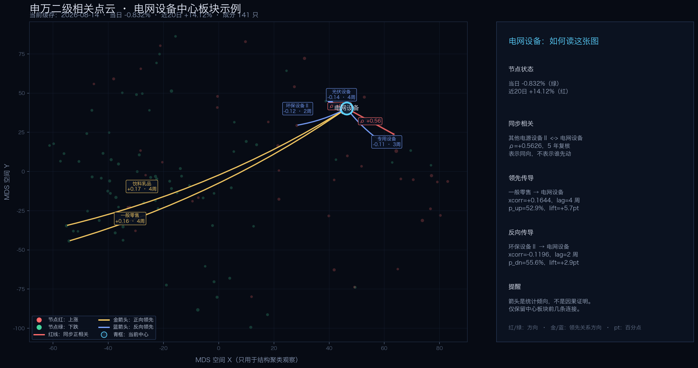

# 30 · 板块相关点云视觉说明

入口：`http://127.0.0.1:8765/sector_corr_cloud.html`

点云展示的是申万二级板块在剔除大盘影响后的关系结构。它用于复盘“哪些板块同步、哪些板块可能存在领先传导”，不是因果证明，也不是买卖信号。

## 颜色与图形含义

| 视觉元素 | 含义 | 如何理解 |
| --- | --- | --- |
| 节点核心色 | 所属社区（按簇着色，默认） | 社区色刻意避开红/绿；切到「按涨跌」时核心本身改为红涨绿跌。 |
| 红色光晕 | 当前收益为正 | 光晕越大越亮，涨幅越明显；平盘几乎无光晕；强势异动会缓慢呼吸。 |
| 绿色光晕 | 当前收益为负 | 同上，表示跌幅。 |
| 灰蓝色节点 | 没有可用收益 | 当前窗口没有足够的行情数据，不参与涨跌判断。 |
| 节点大小 | 按簇着色时为连接强度 Σ\|ρ\|；按涨跌着色时为收益幅度 | 都不是成交量或资金规模。收益幅度由光晕表达。 |
| 红色同步连线 | 正相关 | 两个板块在同一观察窗口内倾向同涨同跌。 |
| 绿色同步连线 | 负相关 | 两个板块在同一观察窗口内倾向一涨一跌。 |
| 金色领先箭头 | 正向领先传导 | 箭头 `A → B` 表示 A 的变化与 B 后续变化呈正向关系，A 先动时 B 更可能同方向跟随。 |
| 蓝色领先箭头 | 负向领先传导 | 箭头 `A → B` 表示 A 先动时，B 后续更可能反方向变化。 |
| 虚线与流动光点 | 关系的动态强调 | 同步模式中只表示关系持续存在，不代表方向；领先模式中光流沿箭头方向流动，帮助辨认 A → B。 |
| 线条亮度、粗细 | 关系强弱 | 越亮、越粗表示相关系数或交叉相关强度越高；不能直接理解为收益大小。 |
| 青色高亮标签 | 当前查询的中心板块 | 通过板块搜索、标的跳转或点击节点聚焦后的中心对象。 |
| 变暗的节点 | 当前焦点之外的对象 | 仍在全局空间中，但暂时弱化，避免抢占中心板块的注意力。 |

项目沿用 A 股界面约定：红色表示上涨，绿色表示下跌。这里的红/绿只表达方向，不表达“好/坏”或“买/卖”。

## 术语小词典

### 相关与领先

| 术语 | 含义 | 在本页面中的口径 |
| --- | --- | --- |
| `ρ` / `corr` | 相关系数 | 两个板块残差收益的 Pearson 相关系数，范围为 -1～+1。正数表示同向，负数表示反向；`|ρ|` 越大，关系越强。同步相关默认要求 `|ρ| ≥ 0.42`，并通过多年方向复核。 |
| `abs` | 绝对强度 | `abs(corr)` 或 `abs(xcorr)`，只保留强弱、不保留方向，用于筛选和排序；方向仍需看原始的 `corr`、`xcorr` 或箭头颜色。 |
| `xcorr` | 交叉相关（cross-correlation） | 用来比较“领先板块 A”与“未来滞后板块 B”的相关性。本项目按周汇总残差收益，计算 `corr(A_t, B_{t+lag})`。正值表示同向传导，负值表示反向传导。 |
| `lag` | 滞后期 | 领先板块与后续板块之间相隔的周数。`lag=2` 表示 A 的变化与 B 约相隔 2 周；不表示精确到某一天。当前搜索 1～4 周。 |
| `sync` | 同步相关参考值 | 领先边记录的同周期残差相关，帮助判断这条领先关系是否也有同步共振；它不是箭头方向，箭头方向由 `source → target` 决定。 |
| `sign` | 关系方向 | `+1` 表示正向，`-1` 表示反向。同步模式映射为红/绿连线，领先模式映射为金/蓝箭头。 |

### 概率与 `pt`

| 术语 | 含义 | 如何阅读 |
| --- | --- | --- |
| `p_up` | 条件跟涨概率 | 领先板块某周残差处于自身历史 80% 分位以上（强势周 t）时，后续板块 **第 t+lag 周** 残差为正的比例（lag 为该边的滞后周数）。 |
| `p_dn` | 条件跟跌概率 | 领先板块某周残差处于 20% 分位以下（弱势周 t）时，后续板块第 t+lag 周残差为负的比例。 |
| `base_up` | 基准上涨概率 | 不看领先板块状态时，后续板块周残差为正的总体比例。 |
| `base_dn` | 基准下跌概率 | 不看领先板块状态时，后续板块周残差为负的总体比例。 |
| `lift_up` | 跟涨概率提升 | `p_up - base_up`，表示触发领先条件后，跟涨概率比平时提高了多少。 |
| `lift_dn` | 跟跌概率提升 | `p_dn - base_dn`，表示触发领先条件后，跟跌概率比平时提高了多少。 |
| `pt` | percentage point，百分点 | 页面把 `lift` 乘以 100 后显示为 `pt`。例如 `p_up=58%`、`base_up=45%`，则 `lift_up=+13pt`，意思是提高 **13 个百分点**，不是相对提高 13%。 |
| `n_up` / `n_dn` | 条件样本数 | 计算 `p_up` / `p_dn` 时实际可用的历史事件数量。样本越少，概率越不稳定；概率相同也要结合样本数判断可信度。 |
| `horizon` | 观察窗口 | 与边的滞后对齐：结果固定取第 t+lag 周（单周）。每个事件对应唯一的结果周，窗口互不重叠。旧口径为“未来 5 个交易日累计”，与滞后周数不一致且窗口重叠，已废弃。 |
| 命中 / `hit` | 顺向命中率 | 正向边：强势周后跟随板块上涨、弱势周后下跌都算命中；反向边方向相反。`base` 为同一预测方向的无条件比例，`lift = hit - base`。 |
| `p_value` / `q_value` | 显著性 | `p_value` 来自循环平移零分布；`q_value` 为 BH-FDR 校正后的值，`q ≤ α` 才算通过（页面标 `FDR✓`）。 |
| 样本外 / `oos_*` | 滚动验证 | 只用训练段选边、定分位门槛，在随后的测试段统计命中率与提升；`oos_n` 为测试段事件数合计，`oos_folds` 为入选的测试段数。 |

页面里的 `p_up`、`p_dn` 是概率字段，不是统计学里的“p-value（显著性检验 p 值）”。显著性看 `q_value`（BH-FDR）与样本外命中，见下文“领先传导的显著性与样本外验证”。

一个完整例子：

```text
A → B，lag=2 周，xcorr=0.18，p_up=58%，base_up=45%，lift_up=+13pt
```

应读作：A 的周频残差变化与 B 约两周后的变化呈中等强度正向关系；当 A 处于较强状态时，B 在未来 5 个交易日累计上涨的历史比例为 58%，比无条件基准高 13 个百分点。它是统计倾向，不是“买入后两周必涨”的承诺。

### 残差、beta 与空间位置

| 术语 | 含义 |
| --- | --- |
| `beta` | 板块对大盘收益的敏感度。先估计板块相对市场的共同波动，再剔除这部分影响，减少“所有板块一起涨跌”造成的假相关。 |
| 残差收益 | 板块实际收益减去大盘 beta 能解释的部分，更接近板块自身相对强弱。点云的同步和领先计算都基于残差，而不是直接使用指数涨跌。 |
| MDS | 多维尺度分析（Multidimensional Scaling）。把板块之间的相关距离压缩到三维空间；空间距离用于辅助观察聚类，不等于收益远近，也不代表因果方向。 |
| `n` | 该申万二级板块参与聚合的成分股数量。它影响板块收益的稳定性，但不是估值或资金规模。 |

## 两种连线模式

### 同步相关

同步相关是无方向关系。红线表示正相关，绿线表示负相关；连线两端没有先后顺序。

相关边基于剔除市场 beta 后的板块残差收益计算，并要求达到相关阈值、且在多个年份方向保持一致。它更适合回答：

- 哪些板块经常一起动？
- 哪些板块可能存在对冲关系？
- 当前上涨或下跌是否扩散到同一产业链或风格群？

### 领先传导

领先传导是有方向关系。箭头尖端指向后续板块：

- “它领先谁”表示从当前中心板块发出的箭头；
- “谁领先它”表示指向当前中心板块的箭头；
- 滞后时间以周为单位，当前计算范围为 1～4 周；
- 面板中的“跟涨/跟跌”是事件条件概率，括号中的提升值是相对于基准概率的差值。
- 候选预筛：`|xcorr| ≥ 0.08`，领先方向比反向至少强 `0.015`，跟涨/跟跌提升的方向必须与 xcorr 符号一致，顺向命中至少提升 2pt，强/弱事件各至少 15 周。预筛只是候选，**不代表显著**。
- 显著性：所有有序板块对做循环平移置换检验 + BH-FDR（默认 α=0.10）。未通过的边默认隐藏，打开「显示未通过FDR的边」后以暗色虚线显示（无流动光点）；每方向 ≤3 条、每次聚焦 ≤12 条的上限不变，通过的边优先。

为了保持可读性，领先传导不会显示全市场所有边：

- 未聚焦中心板块时不绘制领先传导线；
- 聚焦一个中心板块时，每个方向只保留最强的前 3 条；
- 多个中心板块同时聚焦时，最多显示 12 条中心相关连接；
- 右侧详情面板与图上的连接采用同一组筛选结果。

因此，图上没有出现某条传导线，不等于数据中不存在关系，而是它没有进入当前中心板块的可视化优先级。

## 领先传导的显著性与样本外验证

所有参数在 `config/sector_corr_cloud.yaml`（缺省值见 `scripts/reports/sector_lead_stats.py::DEFAULTS`）。

1. **统计量**：周频残差上，`T(A→B) = max_{lag=1..4} |corr(A_t, B_{t+lag})|`。
2. **零分布**：把跟随板块序列循环平移 s 周（s 至少 8+4 周，避免同步相关泄漏），对同样的 1–4 周滞后取最大值。
   循环平移保留了每个序列自身的自相关，“挑最优滞后”的搜索也计入了零分布。所有有序板块对的平移统计量汇总成一个池化零分布，
   `p = (1 + #{null ≥ T}) / (1 + |null|)`。
3. **多重检验**：对全部有序板块对（约 124×123 ≈ 1.5 万次检验）做 Benjamini–Hochberg，`q ≤ α` 才算通过。
4. **方向一致**：正向边要求 `lift_up ≥ 0` 且 `lift_dn ≥ 0`，反向边两者 ≤ 0；不再接受“xcorr 为负但跟涨提升”的边。
5. **滚动样本外**：首个训练段 104 周，之后每 26 周滚动一次。每个训练段只用自身数据选边（同样的预筛、FDR、每源最多 4 条），
   并用训练段的 80%/20% 分位作为事件门槛；在紧随其后的 26 周测试段统计顺向命中、基准与提升。详情面板显示单边的样本外记录，
   「控」面板和全局视图显示汇总。测试段事件少于 6 次时标为“样本不足”。

### 当前结果（2026-10-01 重算，关系样本 2022-01-01 → 2026-09-30，240 周）

- 候选领先边 496 条（每源最多 4 条），**通过 BH-FDR（α=0.10）的为 0 条**，最小 q≈0.38。
- 滚动样本外（6 个测试段，28161 次事件）：命中 49.7% vs 基准 50.2%，提升 −0.5pt；
  训练段内曾通过 FDR 的 19 条边在测试段 208 次事件：49.5% vs 49.3%（+0.2pt）。
- 样本内命中常见 60%–68%，样本外回到 50% 左右，说明旧版箭头基本是样本内选择出来的噪声。

**结论**：按当前数据，领先箭头不能作为“谁下一个动”的依据。默认视图因此不画任何领先箭头；打开开关看到的虚线只用于提出假设。
单边“样本外命中较高”也要结合事件数，并注意 496 条边里总会有一部分碰巧表现好。

### 已知局限

- 池化零分布假设不同板块对在零假设下可交换；自相关差异很大的板块，单对 p 值可能偏乐观或偏保守。
- 循环平移会打断同步相关。若 A、B 高度同步且 B 自身有自相关，滞后相关可能只是“同步 × 自相关”。方向不对称要求只能部分排除这种情况。
- 样本外测试段较短（26 周），单边的样本外统计波动很大。

## 交互、图例与移动端（2026-10-01 UX 更新）

### 默认模式与领先实验

- 默认模式是**同步相关**（`display.default_mode: sync`）。领先按钮标为「领先·实验 / 0 显著」；进入后详情顶部会提示“实验功能”。「显示未通过FDR的边」开关和检验摘要只在领先模式下出现。
- 切换模式（以及切换 FDR 开关）会按新模式重算聚焦的一跳/二跳集合、重建标签并刷新详情，**不移动镜头**。

### 查询与聚焦

- 查询只聚焦**精确匹配**的板块。名字相同即可，忽略末尾“Ⅱ”。如果没有同名板块，就用扩展规则里的 `exact` 项。例如“电力”只聚焦「电力」。
- 扩展规则命中的其他板块（如电网设备、风电设备、光伏设备）显示为「相关扩展」开关芯片，点击后加入或移出核心。全无精确匹配时才整组聚焦。
- 多核心时，详情里的核心板块压缩成一行；邻居/领先行标注「来自 X」，表示这条关系来自哪个核心。
- 「复核」标签表示该邻居与核心之间有一条画在图上的多年复核同步边。

### 镜头

- 「全局」清除聚焦并复位镜头。轨道上的 ⟲「复位视角」把镜头重新对准当前聚焦；未聚焦时回到初始视角。
- 聚焦时，取景会覆盖核心和约 80% 的一跳邻居。
- 自动旋转（`display.auto_rotate`）常开：只在拖动、捏合、滚轮期间暂停，松手 `display.rotate_resume_ms`（默认 1.5 秒）后恢复。聚焦时以 `display.focus_orbit_speed` 绕焦点慢速环绕。系统开启「减少动态效果」时默认不转（`display.auto_rotate_reduced_motion`）。
- 面板遮挡时用 `camera.setViewOffset` 偏移投影中心：桌面左侧面板让画面右移；手机底部抽屉（`display.mobile_panel_vh`，默认 42vh）让画面上移，聚焦点落在可见区域中央。

### 图例与视觉

- 画布上有常驻图例：桌面在右上角并默认展开，手机在左上角并默认收起（`display.legend_open_mobile`）。第七轮起图例只保留社区（或风格）行，颜色、点大小、连线、箭头等编码说明移到「ⓘ 读图」弹层（第八轮起统一走共享 ⓘ 说明弹层，见下文「上下文说明弹层」）。
- 颜色和大小按 |涨跌| 的分位数封顶（`display.color_clip_pct`，默认 90% 分位，下限 `min_ret_scale`），个别极端涨跌不会把其余节点压成同一种颜色。图例会显示当前封顶值。
- 节点使用圆形点精灵和柔光。多年复核的同步边画实线；补充（soft）边画暗灰虚线。当前数据里 424 条同步边全部通过复核，所以页面上暂时没有 soft 边。
- 默认视图：按簇着色时标注各社区名（标在簇核心上）；按涨跌着色时标注涨跌幅前 N 的板块（`display.top_movers_labels`，涨跌各半，带百分比）。聚焦时标注核心和最强的若干邻居（`display.label_limit`）。
- 标签在屏幕空间做去重叠：按优先级放置，被遮挡的低优先级标签会暂时隐藏。

### 拾取与移动端

- 点选按屏幕像素距离判定：鼠标半径 `display.pick_radius_px`（14px），触屏半径 `display.pick_radius_touch_px`（28px）。是否为粗指针沿用共享 `chart-touch.js` 的判定；手指移动超过 10px 视为拖动，不触发点选。
- 手机上控制面板去掉标题和说明，预设与扩展芯片改为单行横向滚动。iPhone 13 上控制区不需要内部滚动。

### three.js 本地兜底

- three.js 0.160.0 已随仓库放在 `scripts/services/static/vendor/three/`（经 `/assets/vendor/three/` 提供，MIT LICENSE 同目录）。页面先加载本地文件，失败时才回落 jsDelivr。调试时可用 `window.__scc.three` 查看实际来源（`local` / `cdn`）。

## 千丝万缕、社区与渐进探索（2026-10-01 二次更新）

### 千丝万缕（同步网）

- 全局视图常显**全部同步边**，做成细丝。424 条边合并成一个 `LineSegments`，只占一次绘制调用，用加色混合。
- 亮度随 |ρ| 线性增加：阈值处为 `display.web_opacity_min`，|ρ|≈0.85 时为 `display.web_opacity_max`。WebGL 的线宽固定 1px，所以强弱只用亮度表达。
- 按簇着色时，每根丝两端分别取两侧板块的社区色，形成渐变；负相关边为灰色。按涨跌着色时，红色表示正相关，绿色表示负相关。
- 聚焦后，同步网按两端节点的亮度逐帧压暗或加亮。与核心相连的边更亮，远处压到 `display.web_focus_dim`。

### 社区与桥梁（`scripts/reports/sector_graph.py`，参数 `graph:`）

- 社区：只在正相关同步边上划分，权重为 |ρ|，算法是 networkx 的 greedy modularity。结果确定、可复现，与 `PYTHONHASHSEED` 无关。小于 `min_community_size` 的社区并入「零散」。
- 簇名：按成员一级行业的加权票数自动命名。`graph.name_overrides` 可以按簇核心指定显示名；核心板块变了会自动回落到行业命名。
- 簇核心：簇内加权度 Σ|ρ| 最高的板块。
- 桥梁：在正相关图上，按「参与系数 × 介数中心性」排序，取前 `bridge_top_k` 个；介数的距离用 1−ρ。图上用淡金色虚线环标出。负相关边表示对冲而不是传导，因此不算桥。
- 当前结果（2026-10-01，关系样本到 2026-09-30）：7 个社区，模块度 Q=0.63，按规模依次为：
  - 大消费·医药：24 个板块，核心食品加工
  - 基建地产链：24 个板块，核心基础建设
  - 周期原材料：23 个板块，核心炼化及贸易
  - 新能源·军工电子：20 个板块，核心电池
  - TMT：15 个板块，核心 IT服务Ⅱ
  - 中游制造：13 个板块，核心专用设备
  - 银行保险：5 个板块，核心城商行Ⅱ
- 当前桥梁：消费电子、化学原料、计算机设备、化学制品、一般零售、文娱用品、服装家纺、包装印刷。
- 生成器的完整重算和 `--from-cache` 重渲都会重新计算社区（秒级）。结果写入 payload 的 `graph` 字段。
- 「控」面板里的「按簇 / 按涨跌」切换节点着色，默认值为 `display.color_by`。图例随当前编码切换，点击社区名可进入该簇。

### 点击过渡（连续，无硬切）

- 镜头沿缓动弧线飞向新焦点，时长 `display.transition_ms`（默认 1.7 秒）；弧线抬升由 `arc_height` 控制。
- 镜头从当前位置和观察方向出发，不会先复位。飞行途中拖动会立即取消飞行。
- 点亮顺序：
  1. 核心先亮。
  2. 一跳邻居按离核心的距离依次点亮，同时有光点沿边从被点的节点向外传播。光点由单个 `Points` 绘制，上限 `pulse_max`。
  3. 二跳邻居随后淡入，从一跳邻居继续发出较弱的光点。
  4. 其余节点和边逐渐压暗。
- 标签随所属节点点亮而淡入；离镜头近的标签会按距离缩小。
- `prefers-reduced-motion`：过渡缩短为 `display.reduced_motion_ms`（默认 350ms），无弧线、无脉冲。

### 渐进探索（逐步参透）

- 每次点击（点云、邻居列表、建议、榜单、查询）都会在**探索路径**上前进一步。顶部面包屑形如「全局 › 电力 › 燃气Ⅱ › …」，可以点任意一步跳回，也可以用 ‹ › 或 Alt+←/→ 后退、前进。点云里用青色折线标出当前路径，最多保留 `trail_max` 步。
- 详情顶部给每一步一行解释。例如：「电力 与 燃气Ⅱ 残差相关 ρ=0.56（多年复核），同属「周期原材料」簇」；跨簇时写明两侧所属的簇；如果目标是桥梁，会注明它通往哪些社区。
- 「下一步建议」包括：
  - **核心**：本簇加权度最高的板块。
  - **桥梁**：本簇通往其他社区的板块。如果当前板块本身就是桥梁，则给出对面社区里与它最相关的板块。
  - **最强未探索邻居**：按 |ρ| 排序，取前 `suggest_neighbors` 个。
- 「导览 ▶」按「全局 → 最大社区 → 簇核心 → 桥梁 → 对面社区核心」逐步演示，每步停留 `tour_step_ms`。任何拖动或点击都会结束导览。

## 收益窗口

- **1日 / 5日 / 20日**：光晕、边着色和社区摘要分别使用所选日期的当日涨跌、近 5 个交易日、近 20 个交易日的累计涨跌（逐日复利）。
- 拖动底部日期滑块或点 ▶ 可回到近 20 个交易日中的任一天，详见「光晕、边着色与逐日回放」。

切换收益窗口只改变节点的市场状态展示，不会重新计算同步相关或领先传导边。

## 光晕、边着色与逐日回放（2026-10-01 第五轮）

### 光晕（收益编码，不抢社区色）
- 节点核心保持社区色；外层光晕编码收益：红 = 涨，绿 = 跌（`display.halo_up_color / halo_down_color`）。
- 光晕大小与亮度 ∝ |收益| / 封顶值。封顶值按周期（1/5/20 日）分别取**整个回放窗口**内全部板块 |收益| 的 90% 分位（`color_clip_pct`），因此回放时不同日期之间可以直接比较；平盘板块几乎没有光晕。上限见 `halo_max_scale`、`halo_max_opacity`。
- 呼吸：|收益| 超过封顶值，或位列当期前 `breathe_top_n` 的板块，光晕会缓慢呼吸（周期 `breathe_period_ms`，幅度 `breathe_amp`，最多 `breathe_max` 个）。开启「减少动态效果」时不呼吸。
- 「控」面板里原有的「按簇 / 按涨跌」切换仍然可用：按涨跌时核心也变成红/绿，光晕照旧。

### 边着色（同步网）
- 两端同涨：丝线泛红；两端同跌：泛绿；方向不一致：变暗。强度 = min(|r₁|, |r₂|) / 封顶值 × |ρ|，混合比例由 `edge_tint_mix` 控制，`edge_tint: false` 时关闭。
- 仍然是一次合并绘制（顶点色），回放时只更新颜色缓冲区。

### 周期与逐日回放
- 底部回放条包括 ▶/⏸、日期滑块、当前日期和 1/5/20 日切换（默认 `default_period`）。
- ▶ 从窗口起点逐日播放近 `daily.replay_days`（默认 20）个交易日，每天停留 `replay_step_ms`（默认 800ms），光晕和边色在 `replay_tween_ms` 内平滑过渡；`replay_loop` 控制是否循环。拖动滑块会暂停播放并跳到该日。
- 回放可以和聚焦、探索路径、自动旋转同时使用：聚焦某板块后，它和它的邻居也会逐日变化；标签显示 `@MM-DD`，详情显示日期和周期。
- 成分股列表、涨跌榜和领先关系仍是最新日期的数据，不随回放变化；位置和边也不随日期变化。

### 社区摘要
- 图例中每个社区一行：社区色点、全名（不截断，必要时换行）、上涨占比小条（红 = 上涨部分）、占比和等权平均收益；「簇」列表显示「新能源·军工电子 +1.8%，85% 上涨」。点击社区名仍会进入该社区。

### 数据与体积
- 生成器（`scripts/reports/sector_daily.py`）从 `stock_kline_cache.parquet` 计算申万二级板块的成分股**等权**日收益：收益 = 收盘 / 前收 − 1；缓存早期缺「前收」时用该股上一交易日收盘代替（除权日可能失真）；|日收益| > `daily.max_abs_ret`（35%）视为异常并剔除。
- 嵌入窗口为 `replay_days + max(periods) − 1` 个交易日（当前 39 天），存成整数基点数组（`daily.bp`），约 23KB。页面总大小约 1.46MB（gzip 约 280KB），主要是股票索引和成分股数据。
- 行情缓存不可用时 `daily` 为空，页面回退到原有的当日/近 20 日数值，回放条隐藏。

## 异动观察（2026-10-01 第六轮）

图例下方的「异动观察」面板按回放日期自动挑出 5–8 个值得看的板块，每条一行理由。信号在生成器里（`scripts/reports/sector_signals.py`）由板块日收益和同步图计算，参数见 `config/sector_corr_cloud.yaml` 的 `signals:`。

**这些是描述性信号，不是预测**：每天只用当日及之前的日收益，说明发生了什么。ρ、社区和桥梁是全样本的结构估计（与关系样本同期），不随回放日期重算。

### 统一尺度
- 当日横截面稳健 σ = 1.4826 × MAD（全部板块当日收益），下限 `sigma_floor`（0.35%）。各类分数都以 σ 为单位，再乘以类型权重 `weights`，然后统一排序。

### 六类信号（默认阈值）
| 标签 | 规则 | 分数 |
| --- | --- | --- |
| 逆簇 | 社区（≥4 个成员）里，除自身外上涨占比 ≤ 35% 而它涨，或 ≥ 65% 而它跌；\|r − 簇中位\|/σ ≥ 1.2，且 \|r\| ≥ 0.6% | \|r − 中位\|/σ × (0.5 + \|上涨占比 − 0.5\|) |
| 脱钩 | 长期 ρ ≥ 0.6 的同步对；近 5 日累计收益差 ÷（此前 60 日日收益差的标准差 × √5）的绝对值 ≥ 2，且累计差 ≥ 2% | \|z\| × ρ |
| 持续 | 同向连续 ≥ 3 天且最近 3 天幅度递增（\|r\| ≥ 0.5%）；或连涨/连跌 ≥ 3 天后的首个反向日，\|r\|/σ ≥ 1.2 | \|r\|/σ ×（连续天数加成） |
| 桥梁 | 桥梁板块 \|r\|/σ ≥ 1.5 且 \|r\| ≥ 1%；远端 = 与它 Σρ 最大的其他社区。事件当天显示「观察中」；之后 2 日内远端中位数累计同向 ≥ 0.3% 记为「跟随」，期满未达到记为「未跟随」，未满 2 日仍为「观察中」 | \|r\|/σ × 0.8^(距事件天数)，跟随 ×1.15 |
| 分化 | 社区（≥5 个成员）\|中位数\| ≤ 0.4%，(P90 − P10)/σ ≥ 2.5，领涨 ≥ +1%、领跌 ≤ −1%；点名领涨和领跌 | (P90 − P10)/σ ÷ 2 |
| 风格 | s = 进攻等权均值 − 防御等权均值（主标签）。一方连续 ≥ 3 天占优后另一方首次反超（\|s\| ≥ 0.3%）；或 \|s\| / 此前 60 日 s 的标准差 ≥ 2 且 \|s\| ≥ 0.8%（价差极值） | max(\|z\|, 1) × (1 + 0.1 × 连续天数)，权重 1.1；`pin_types` 让它优先占位 |

### 排序、去重与「第N天」
- 每类有上限（`type_caps`：逆簇 2、脱钩 2、持续 2、桥梁 2、分化 1、风格 1），全天最多 `max_items` = 8 条。同一个板块（包括脱钩的另一方）只出现一次。
- 严格阈值不足 `min_items` = 5 条时，阈值乘以 `relax` = 0.7 补足，补足条目淡显，悬停可见「放宽阈值补足」。
- 同一信号（同类型、同板块；持续性区分「放大」和「反转」）连续多天入选时显示「第N天」。计数从回放窗口第一天开始。

### 交互
- 面板随回放和滑块逐日更新，新出现的条目短暂高亮。点击条目会用原有的弧线过渡聚焦该板块（脱钩同时聚焦两者，分化进入该社区），理由写入探索路径。
- 桌面端右侧一列：图例在上，异动观察在下（高度不够时面板内滚动）。手机端默认收起成一行（日期 + 首条摘要），展开后最高 46vh、可滚动；`display.signals_open / signals_open_mobile` 控制默认展开状态。

### 无未来数据
- 第 t 天只把截至 t 的行交给计算函数。桥梁跟随只看事件日之后、且不晚于 t 的数据。
- 测试 `tests/test_sector_signals.py::test_no_look_ahead` 做两件事：截断到第 t 天后重算，以及把 t 之后的数据换成极端随机数，两种情况下第 t 天及以前的信号都必须与全量计算逐条相同。
- 生成器额外读取 `history_days` = 120 个交易日的日收益（只用于脱钩的历史价差，不嵌入页面）。页面多出约 21KB 信号数据（连同面板代码约 32KB），总大小约 1.50MB。

## 读图说明、风格视角与风险偏好（2026-10-01 第七轮）

### 图例瘦身与「ⓘ 读图说明」
- 图例只保留社区行：色点 | 全名 | 上涨占比小条 | 上涨占比 | 均值。上涨占比和均值是两列，右对齐，中间有分隔线，不会再挤成「100%+3.00%」。标题行显示区间和日期，例如「当日 · 09-30」。
- 光晕、节点色、点大小、千丝万缕、桥梁虚线环、探索路径和领先箭头的说明，放进图例标题旁的「ⓘ 读图」。第八轮起风格规则和风险偏好的解释分别移到「着色」和「风险偏好」各自的 ⓘ，弹层实现见「上下文说明弹层」。

### 风格标签（`scripts/reports/sector_style.py`，参数 `style:`）
每个申万二级板块有一个主标签（进攻 / 防御 / 周期 / 成长 / 价值），可能还有一个副标签：
1. **风险维度**：近 `lookback_days`（500）个交易日，计算对沪深300（`benchmark.code`）的 beta、年化波动率和最大回撤，各取横截面分位，按 `risk_weights`（0.5 / 0.3 / 0.2）加权得到风险分。风险分 ≥ `risk_hi`（0.70）为进攻，≤ `risk_lo`（0.30）为防御。
2. **属性维度**：一级行业在 `cyclical_l1`（有色、钢铁、煤炭、基础化工、石油石化、建筑材料）里的为周期。其余的，如果成分股最新动态市盈率（正值）中位数的分位 ≥ `growth_pe_pct`（0.60），或亏损股占比 ≥ `loss_share_growth`（0.40），为成长；否则为价值。
3. **主副标签**：风险维度命中时，主标签取进攻/防御，副标签为属性维度。否则主标签为属性维度；风险分 ≥ 0.6 时副标签为进攻，≤ 0.4 时为防御。
4. **人工覆盖**：`overrides`（二级）优先于 `l1_overrides`（一级）。覆盖后，规则算出的主标签如果不同，降为副标签。
   - 默认一级覆盖：银行、公用事业（含电力、燃气）、食品饮料、医药生物 → 防御；国防军工、计算机 → 进攻。
   - 默认二级覆盖：半导体、证券Ⅱ → 进攻。
5. 缓存里没有 10 年国债收益率，所以没有使用利率敏感度。
6. 当前结果（2026-09-30）：进攻 35、防御 36、周期 12、成长 21、价值 20。

### 风格视角
- 「控」面板的着色切换增加「风格视角」：节点核心按风格着色（颜色见 `style.colors`，避开红绿），光晕仍是涨跌。
- 「同风格连线」：每个点连到空间上最近的 `link_k`（2）个同风格点，去重后合并为一个 LineSegments（一次绘制）；聚焦时变淡；可以单独开关（`style.links`）。
- 图例切换成风格行：风格（板块数）| 上涨占比 | 均值。
- 回放时标签显示当日涨跌前列的板块。

### 风险偏好
- 回放条右侧显示「风险偏好」= 进攻主标签板块的等权均值 − 防御主标签板块的等权均值（所选区间、所选日期）。为正 = 偏进攻（risk-on），红正绿负。
- 小折线是回放窗口内逐日（1 日）价差的累计，只画到当前日期，回放时会逐步延长。
- 手机端风险偏好单独占回放条第二行，异动观察面板自动下移到回放条下沿。`display.risk_appetite` 控制是否显示。

### 风格切换信号
- 异动观察的第六类，规则见上表。每天只用截至当天的数据计算。`tests/test_sector_signals.py::test_style_switch_and_no_look_ahead` 用截断和篡改未来数据两种方法检验。

## 上下文说明弹层（2026-10-01 第八轮）

页面上只保留一行关键数字或标签；方法、口径和注意事项都收进各区块自己的 ⓘ，点开才显示。

| 区块 | 常驻（一行） | ⓘ 位置 → 弹层内容 |
| --- | --- | --- |
| 图例 | 社区 / 风格行 | 图例标题「ⓘ 读图」→ 光晕、节点色、点大小、千丝万缕、补充边、桥梁环、探索路径、领先箭头、风格视角的编码 |
| 搜索与筛选 | 「申万二级 · 相关点云」 | 面板标题旁 ⓘ →「关于这张图」：去市场 beta、行情日期与关系样本的区别、查询方式、领先只显示前 3 条、非历史时点信号；方法注释 |
| 涨跌榜 | 排序窗口与日期 | 面板标题旁 ⓘ → 排序口径、行情日期、点击聚焦 |
| 聚焦详情（全局） | 「124 板块 · 424 同步边」（有补充边时加「· N 补充」） | 面板标题旁 ⓘ →「方法与口径」：复核边 / 补充边数量与 \|ρ\| 阈值、同步边与箭头的检验方法（循环平移零分布 + BH-FDR + 滚动样本外，非因果），以及数据与样本 |
| 领先传导（实验） | 「实验 · N 条通过 FDR」、「领先候选 496 · FDR 通过 0」、「另有 N 条未通过 FDR，已隐藏」 | 行内 ⓘ → 实验提示全文、BH-FDR 与样本外命中统计、隐藏规则 |
| 着色 | 按簇 / 按涨跌 / 风格视角 | 着色切换后的 ⓘ →「着色与风格」：三种着色含义、各风格板块数、风格打分规则（`style.note`） |
| 异动观察 | 日期与首条摘要 | 标题旁 ⓘ → 「描述性信号，不是预测」脚注、六类信号的一句话定义、放宽阈值与「第 N 天」 |
| 风险偏好 | 数值 + 小折线 | 回放条里的 ⓘ → 定义、当前区间与日期的进攻 / 防御均值和窗口累计 |
| 底栏（桌面） | 「124 板块 · 424 同步边 · 涨跌榜 日期」 | 底栏 ⓘ →「数据与样本」：关系样本起止、涨跌榜日期、阈值、FDR α、基准与滚动 beta 窗口、生成时间 |

保持常驻、不收进弹层的警告：顶部红色 `#warnBar`（市场基准失败、关系样本过旧），以及底栏里的红色 `.stale` 提示（样本过旧、非沪深300）。桌面端 `#warnBar` 放在右栏左侧，不再压住图例。

实现：
- 全页只有一个 `#infoPop`（`popover="auto"`），所有 ⓘ 是 `.info-btn[data-info=键]`，由一个委托点击处理；内容在注册表 `INFO` 里按键生成（打开时读取当前日期、区间等实时数值）。图例的编码行带有会被 JS 更新的 id，所以打开时把 `#lgGuideSrc` 节点移入弹层，关闭时移回，不复制。
- 关闭：点外部（原生轻触关闭，另补 pointerdown/touchstart 捕获，兼容 iOS）、Esc、右上 ×、再点同一个 ⓘ。点外部关闭的那一下不会穿透去选中板块。不支持 popover 时退回 class 切换。
- 定位：桌面宽 380px，贴着按钮、夹在视口内。手机（≤900px）左右各留 10px，放在按钮下方或上方空间较大的一侧，最大高度 = 该侧可用高度（不超过 62% 视口），内容超出时在弹层内滚动。
- 搜索面板的说明原文（`#paneCtrl .sub`）仍在 HTML 里，用 CSS 隐藏，由 JS 读入弹层；底栏原文在运行时收进「数据与样本」弹层后改写成一行。
- 校验：`window.__scc_info`（`open(key)`、`close()`、`isOpen()`、`key`）；截图与结果在 `output/ui-qa/sector_cloud_popovers/`。

## 一眼看出板块风格（2026-10-01 第九轮）

- **详情徽章**：聚焦单个板块时，标题旁显示风格徽章，如「电力 · 防御 / 价值 · 人工」「贵金属 · 进攻 / 周期」。颜色与风格视角一致（`style.colors`），副标签用副风格色，「人工」表示来自覆盖名单。
- **判定依据**：点徽章打开共享 ⓘ 弹层「风格判定依据」，内容包括：
  - 风险分 = 0.5×beta 分位 + 0.3×波动分位 + 0.2×回撤分位，并说明是否 ≥0.70 / ≤0.30；
  - beta、年化波动、最大回撤的原始值（近 500 个交易日，对沪深300）；
  - 属性来源：一级行业在周期名单 / 市盈率分位 ≥60% / 亏损股占比 ≥40% / 价值；
  - 人工指定时写明来源（`style.overrides`「二级名」或 `style.l1_overrides`「一级名」），以及规则原本的结果、是否降为副标签。
- **悬停 / 点按提示**：桌面悬停节点显示「名称 · 风格 / 副风格 · 区间涨跌」；手机点按节点在顶部浮层下方显示同样的提示 2.6 秒。聚焦后核心标签写成「名称 · 风格」。
- **图例筛选**：风格视角下点图例里的风格行，只高亮该风格，其余变暗（亮度 × 0.12），同风格连线也只留这一组；再点同一行取消。图例标题显示「· 仅防御」。
  - 筛选与聚焦相乘：聚焦电力时防御以外的邻居也变暗。回放、区间切换照常。
  - 切回「按簇 / 按涨跌」或点「全局」会清除筛选。
  - 全局视图下，详情面板列出该风格全部板块，按当前区间涨跌排序；涨跌榜里其他风格的行变淡。
- **紧凑标签**：邻居列表、领先列表、异动观察条目（风格切换和簇内分化两类除外）、涨跌榜行，在名称后加单字风格标签（攻 / 防 / 周 / 成 / 价），悬停可看全称。
- **搜索**：板块模式下输入「防御 / 进攻 / 周期 / 成长 / 价值」（可带「型 / 类 / 板块 / 风格」），回车即切到风格视角并筛选该组，同时打开详情列表。
- 数据：`sector_style.compute_style_tags` 为每个板块增加 `bp / vp / mp / pp`（beta、波动、回撤、市盈率的横截面分位）、`nat`（属性来源）和 `rule`（覆盖前的规则结果），并输出 `rules`（阈值与权重）。连同新增代码，页面总大小约 1.56MB。
- 校验接口：`__scc.setStyleFilter(k)`、`__scc.styleFilter`、`__scc.styleWhy(id)`、`__scc.tipId`、`__scc.nodeScreen(id)`；截图与结果在 `output/ui-qa/sector_cloud_styletag/`。

## 申万一级（2026-10-01 第十轮）

点云中的点仍是申万二级；申万一级取自节点的 `l1`（当前 31 个一级，二级数 1–7 个）。
- **选择**：「控」面板的下拉框「申万一级 · 全部（31）」列出全部一级及其二级数。选中后：
  - 该行业的二级高亮、其余变暗（沿用聚焦的逐点点亮过渡），镜头飞过去取景；
  - 详情面板标题为一级名，显示一级汇总：所选区间的等权平均涨跌、上涨家数 / 占比、日期；
  - 列表按涨跌排序，每行有二级名、风格单字标签、所属同步社区（色点 + 社区名）和涨跌；点任意一行转为聚焦该二级。
  - 回放时汇总、排序和标签逐日更新；与按簇 / 按涨跌 / 风格视角三种着色和风格筛选都能叠加。
  - 取消：下拉框选「全部」、点「× 清除」、在图例里再点同一行，或点「全局」。
- **着色「按申万一级」**：节点色 = 一级行业（黄金角均分色相）。图例换成一级行业行：一级（二级数）| 上涨占比 | 均值，按二级数排序，可滚动。点击行与下拉框选择等价，再点取消。全局时标签显示二级数最多的 14 个一级。
- **搜索**：输入一级全名（如「电力设备」「医药生物」）即选中该一级。优先级：
  1. 二级精确匹配（忽略末尾「Ⅱ」）或查询扩展里的 `exact` 项；
  2. 一级全名；
  3. 原有查询扩展 / 模糊匹配（如「新能源」）。
  - 例：「电力」仍聚焦二级电力；「银行」没有同名二级，选中一级银行（4 个二级）；「房地产」由原来的模糊扩展改为选中一级房地产。
- **徽章与提示**：聚焦单个二级时，标题旁在风格徽章后显示「一级 · 公用事业」，点击即选中该一级。桌面悬停 / 手机点按提示里也带一级名。
- 说明写在共享 ⓘ「申万一级」里（下拉框旁、一级详情的副标题旁），页面上不加说明文字。
- 校验接口：`__scc.setSw1(k)`、`__scc.sw1Sel`、`__scc.sw1List()`、`__scc.sw1Agg(k)`；截图与结果在 `output/ui-qa/sector_cloud_sw1/`。

## 取景与页面体积（2026-10-01 第十一轮）

- **取景避开浮层**：`visibleRect()` 计算真正可见的矩形。
  - 手机：上边 = 面包屑 / 图例 / 回放条 / 异动观察中位于上部者的最低边；下边 = 底部抽屉（`offsetTop`，不受滑入动画影响）或底部轨道的上沿。
  - 桌面：左边 = 轨道 / 面板右沿；右边 = 右栏左沿；下边 = 回放条上沿。四周各留 8px。
- 投影中心移到该矩形中心（`setViewOffset`）。取景沿当前视线方向，把高亮点的包围盒中心对准矩形中心，再逐点求最小距离，使每个点满足 |x|/(d−z) ≤ tanX、|y|/(d−z) ≤ tanY；横向另留约 60px、纵向约 12px 给标签。
- 适用于单点 / 多点聚焦（核心 + 一跳）、社区、风格筛选、申万一级。抽屉先打开再取景。可见区很小时临时放宽 `controls.maxDistance`（上限 900），回全局时恢复 380。
- 校验：`__scc.visibleRect()`、`__scc.frameIds()`、`__scc.screenOf(id)`。iPhone 13 可见区约 y 178–313，电力设备 6/6、食品饮料 6/6、基础化工 7/7、搜索「电力」7/7、社区 24/24、风格「防御」36/36 全部落在区域内；结果在 `output/ui-qa/sector_cloud_fix/qa_result.json`。
- **页面体积**：12810a0 → c182a46 的「1.56MB → 1.39MB」是把字符数当成了字节数。
  - 页面约 9 万个中文字符，UTF-8 下每个占 3 字节。实际字节数是 1.557MB → 1.566MB（+9.4KB，即申万一级代码），嵌入数据都是 1,407,544 字节，没有变化。
  - 各字段数量一致：124 节点、424 同步边、496 领先边、39 天回放、20 天信号、124 个板块成分（4364 行）。
  - 股票索引 5505 → 5512 来自 StockInfo 新增 7 只，没有丢失数据。

## 正确的阅读顺序

1. 先用“板块”或“标的”查询，确定一个中心板块。
2. 先看中心节点的当日/近 20 日状态，再切换到“同步相关”观察同涨同跌或对冲关系。
3. （可选）切换到“领先·实验”模式。当前没有任何领先边通过 FDR，只把箭头当作待验证的假设。
4. 结合右侧的滞后周数、交叉相关和跟涨/跟跌概率，记录为研究假设。
5. 回到标的上下文、选股日记或回测页面验证，不要把点云关系直接当作下单依据。

## 实例：电网设备中心板块

> 注：本节数值来自 2026-09-18 的旧口径（全样本 beta、5 日累计事件窗、无 FDR），仅用于说明阅读方法。按新口径，这些领先边均未通过 FDR。

下面这张说明截图使用当前本地缓存的点云坐标和连接数据重绘，颜色、箭头和筛选口径与页面一致。数据缓存生成于 `2026-09-18`，行情截止 `2026-08-14`。



### 1. 先读中心节点

当前“电网设备”属于申万一级“电力设备”，共有 141 只成分股：

- 当日涨跌：`-0.832%`，所以切换到“当日”时节点呈绿色；
- 近 20 日涨跌：`+14.12%`，所以切换到“近20日”时节点呈红色。

这表示电网设备当天回调，但阶段趋势仍然上涨。节点颜色取决于当前收益窗口，不能把当日绿色理解成长期走弱。

### 2. 再看同步相关

图中红色同步关系包括：

| 关系 | 数值 | 解读 |
| --- | ---: | --- |
| 其他电源设备Ⅱ ↔ 电网设备 | `ρ=+0.5626`，5 年复核 | 两个板块历史上较容易同涨同跌；这是无方向关系，不能说谁领先谁。 |
| 电网设备 ↔ 风电设备 | `ρ=+0.4710`，3 年复核 | 存在中等强度的同向变化倾向，但强度弱于上一条。 |

### 3. 最后看领先传导

聚焦“电网设备”后，页面只保留中心板块相关的少量箭头。

#### 谁领先电网设备

| 连接 | 颜色 | 滞后 | `xcorr` | 条件概率示例 |
| --- | --- | ---: | ---: | --- |
| 一般零售 → 电网设备 | 金色 | 4 周 | `+0.1644` | `p_up=52.9%`，`lift_up=+5.7pt` |
| 饮料乳品 → 电网设备 | 金色 | 4 周 | `+0.1674` | `p_up=51.1%`，`lift_up=+3.9pt` |
| 环保设备Ⅱ → 电网设备 | 蓝色 | 2 周 | `-0.1196` | `p_dn=55.6%`，`lift_dn=+2.9pt` |

例如“一般零售 → 电网设备”表示：一般零售先出现较强变化后，电网设备约 4 周后倾向同向变化。其后续 5 个交易日上涨概率为 `52.9%`，而无条件基准为 `47.3%`，因此提升约 `5.7 个百分点`，页面显示为 `+5.7pt`。

#### 电网设备领先谁

| 连接 | 颜色 | 滞后 | `xcorr` | 条件概率示例 |
| --- | --- | ---: | ---: | --- |
| 电网设备 → 光伏设备 | 蓝色 | 4 周 | `-0.1393` | `p_up=50.7%`，`lift_up=+4.0pt` |
| 电网设备 → 专用设备 | 蓝色 | 3 周 | `-0.1058` | `p_dn=57.0%`，`lift_dn=+4.2pt` |

这里的蓝色表示负向传导，不是“蓝色就应该卖出”。它表示电网设备先动时，目标板块在周频线性关系上更偏向反方向变化。

### 4. 为什么 `xcorr` 和概率提升可能不一致？

以“电网设备 → 光伏设备”为例：

```text
xcorr = -0.1393
p_up = 50.7%
base_up = 46.7%
lift_up = +4.0pt
```

`xcorr` 衡量的是整个样本期的周频线性关系；`p_up` 和 `lift_up` 衡量的是“领先板块处于较强状态”这一特定事件之后，目标板块未来 5 个交易日的方向概率。两者观察角度不同，所以可能出现负向交叉相关、但特定事件下跟涨概率提高的情况。

这类结果应记录为“待验证研究假设”，而不是直接转换成交易规则。尤其要同时查看样本数量、滞后期、同步相关和不同市场阶段的稳定性。

## 数据口径与限制

- 板块粒度：申万二级行业。
- 关系计算：先剔除市场 beta，再计算同步残差相关；领先传导使用周频残差交叉相关。（口径更新见“市场基准与滚动 beta”。）
- 当前领先传导还要求方向不对称，并且跟涨或跟跌事件概率相对基准有提升，目的是过滤纯噪声边。
- 点云是当前缓存数据的结构观察；通过每日精选或标的上下文进入时，仍然是当前结构参考，不会自动还原历史某一天的点云状态。
- 关系是统计关联，不代表因果关系；行业成分、市场环境、涨跌停和流动性变化都可能造成失效。
- 颜色、大小、亮度和箭头方向都不能单独构成买卖条件。

## 市场基准与滚动 beta

- **基准**：沪深300（`sh000300`），从 `cache/index_kline_cache.parquet` 读取（`data/index.py::IndexData().cache`）。
  旧版调用了不存在的 `IndexData.get_kline()`，异常被吞掉后**一直静默退回板块等权均值**。现在基准不可用时按 `fallback_codes` 依次尝试，
  全部失败才退回等权，并在页脚和顶部告警条中标红。
- **滚动 beta**：`resid_t = r_t − (α_{t−1} + β_{t−1}·m_t)`，α/β 用截至 t−1 的 120 个交易日估计（至少 60 日），不使用未来数据；
  关系样本起点前会自动多取约一个窗口做预热。
- **关系样本**：板块日收益改为直接由 `stock_kline_cache.parquet` 收盘价重算（与 `features.daily` 的 mom1 同口径），覆盖到最新交易日；
  旧的 `indicators_mom1.parquet` 只到 2026-08-14，现在只作兜底。
- **过期提示**：关系样本截止日比行情晚超过 `stale_weeks`（默认 2 周）时，页脚标红并给出重算命令。
- **对同步边的影响**：改用沪深300 + 滚动 beta 后，同步边从 239 条（200 条复核 + 39 条 soft）增至 424 条（全部通过多年复核）。
  原因是沪深300 偏大盘，等权的板块残差里仍保留了市值/风格这类共同因子，残差相关整体抬高。阅读空间聚类时要记住这一点；
  如需剔除风格因子，可在配置里换更宽的基准，或后续加入风格因子回归。
- 位置与边仍用整个样本期估计（每次重算都会变），不是逐日的历史时点结构。

## 维护位置

- 计算与页面生成：`scripts/reports/gen_sector_corr_cloud.py`
- 逐日板块收益（回放）：`scripts/reports/sector_daily.py`
- 异动观察信号：`scripts/reports/sector_signals.py`
- 风格标签：`scripts/reports/sector_style.py`
- 统计内核（滚动 beta、置换检验、FDR、样本外）：`scripts/reports/sector_lead_stats.py`
- 参数：`config/sector_corr_cloud.yaml`
- 数据缓存：`cache/sector_corr_cloud.json`
- 生成页面：`output/sector_corr_cloud.html`
- 标的上下文入口：`scripts/services/static/classification.js`、`scripts/services/static/symbol-page.js`

重渲染页面：

```bash
python -m scripts.reports.gen_sector_corr_cloud --from-cache --no-nav
```
