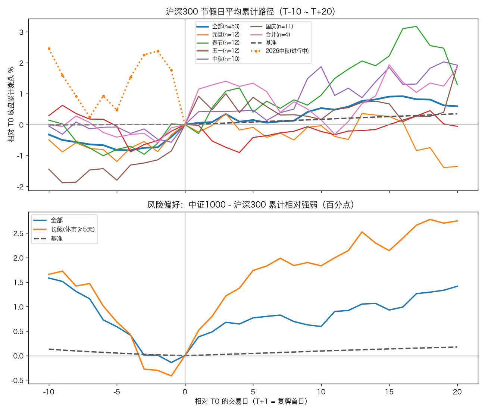

# 33 — 节假日效应回测（元旦 / 春节 / 五一 / 中秋 / 国庆）

页面：<http://127.0.0.1:8765/holiday_effect.html>（导航页“专题研究 → 节假日效应回测”）

## 结论先行（样本 2015-01-01 ~ 2026-09-24，沪深300，数字均来自 2026-09-25 运行结果）

共识别 55 个休市事件，其中 53 个已走完 T+20：元旦 12、春节 12、五一 12、中秋 11（完整 10）、
国庆 12（完整 11）；2017/2020/2023/2025 中秋与国庆合并休市 4 次（只计 1 次，同时计入
“中秋”“国庆”分组）。2015 中秋（09-27 周日）只落在周末，未形成额外休市。“剔除异常年”
口径默认排除 2015（股灾）与 2024（9 月底政策行情）的事件。

| 分组 · 口径 | n | 节前5日 | T0当日 | T1跳空 | 节后5日 | 节后10日 | 节前量比 中位/缩量占比 | 中证1000RS 节前5日 | 中证1000RS 节后5日 |
|---|---:|---:|---:|---:|---:|---:|---:|---:|---:|
| 全部 · 全部年份 | 53 | +0.98 / 53% | +0.42 / 60% | +0.27 / 66% | +0.15 / 58% | +0.53 / 55% | 0.90 / 70% | −0.55 / 43% | +0.77 / 62% |
| 全部 · 剔除异常年 | 44 | +0.18 / 48% | +0.24 / 59% | −0.09 / 64% | −0.01 / 59% | −0.36 / 55% | 0.89 / 75% | −0.65 / 36% | +0.65 / 64% |
| 长假(≥5天) · 剔除异常年 | 26 | +0.15 / 50% | +0.13 / 54% | −0.15 / 62% | +0.22 / 62% | −0.06 / 54% | 0.87 / 77% | −1.10 / 27% | +1.74 / 81% |
| 春节 · 全部年份 | 12 | +0.90 / 67% | −0.00 / 58% | −0.13 / 75% | +0.40 / 67% | +0.95 / 50% | 0.90 / 83% | +0.26 / 67% | +3.13 / 100% |
| 国庆 · 剔除异常年 | 9 | +0.21 / 44% | +0.09 / 56% | +0.34 / 78% | +0.53 / 67% | −0.51 / 56% | 0.83 / 89% | −1.65 / 11% | +0.01 / 56% |
| 中秋 · 剔除异常年 | 9 | +0.41 / 56% | +0.70 / 67% | +0.20 / 67% | −0.16 / 44% | −1.78 / 44% | 0.95 / 67% | −0.18 / 44% | −0.83 / 44% |

单元格为“均值% / 胜率”；RS 为中证1000 收益 − 沪深300 收益（百分点），胜率为跑赢占比。
基准（全部交易日）：节前5日 +0.09%，T0 当日 +0.02%，T1 跳空 −0.06%（胜率 45%），节前量比缩量占比 56%。

1. **节前缩量是最稳定的现象**：全部事件节前量比中位数 0.90、缩量占比 70%（基准 56%，p=0.031）；
   剔除异常年 75%（p=0.003）。
2. **T0 与复牌跳空的溢价主要来自异常年**：全样本 T0 +0.42%（p=0.035）、T1 跳空 +0.27%（p=0.003）；
   剔除 2015/2024 后分别为 +0.24%（p=0.28）、−0.09%（p=0.76），跳空胜率仍有 64%，但均值不再显著。
3. **“节前去风险、节后再风险”在长假上成立，主要由春节驱动**：长假剔除异常年，中证1000 节前 5 日
   跑输 1.10pp（跑赢仅 27%，p=0.029），节后 5 日跑赢 1.74pp（81%，p=0.002）；春节节后 5 日
   中证1000 跑赢 3.13pp，12 次全部跑赢。
4. **中秋/国庆不同**：国庆节前小盘去风险明显（剔除异常年跑输 1.65pp，跑赢 11%），但节后 5 日
   只 +0.01pp，节后 10 日 −0.87pp；中秋节后 10 日中证1000 跑输 2.79pp（跑赢 11%）。
   秋季两节没有“节后再风险”，更偏大盘风格。



## 2026 当前位置（数据截至 2026-09-24，即 2026 中秋的 T0；2026 国庆 T0 为 09-30，还剩 3 个交易日）

| 项目 | 当前 | 全部节前均值 | 全部分位 | 国庆节前均值(剔除异常年) | 国庆分位 |
|---|---:|---:|---:|---:|---:|
| 沪深300 近5日 | −0.47% | +0.98% | 34% | +0.21% | 44% |
| 沪深300 近10日 | −2.40% | +0.53% | 26% | −0.13% | 22% |
| 沪深300 T0当日 | −1.73% | +0.42% | 2% | +0.09% | 0% |
| 沪深300 节前量比 | 0.94 | 0.93 | 62% | 0.83 | 89% |
| 中证1000−沪深300 近10日 | +2.17pp | −1.47pp | 91% | −2.08pp | 100% |
| 中证500−沪深300 近10日 | +1.19pp | −0.87pp | 83% | −1.36pp | 100% |
| 科创50−沪深300 近10日 | +5.76pp | +0.83pp | 83% | +2.49pp | 60% |

今年节前大盘偏弱、T0 当日跌幅处于历史最低一档，而小盘相对沪深300 仍偏强、缩量不明显，
与历史“节前小盘去风险 + 缩量”的常态相反。以上为历史统计关联，不构成投资建议。

## 页面内容

2026-09-25 第二次改版：采用 **设计 A「专业终端风」**。在 Magic Patterns 比较了两个方向（A 专业终端风、B 研究报告风），
选定 A，设计稿见 <https://www.magicpatterns.com/inspiration/207ef2b5-2b16-463e-85fc-30c365b24fa2>。页面默认深色，
信息排得较密，数字用等宽字体，日 K 占主要位置。

自上而下：

1. **顶部行情条**：沪深300 最新收盘和涨跌、近5日 / 近10日 / 最新一日 / 量比，以及每个代理指数的近10日相对强弱
   （每项带历史分位），最右侧是“距下次休市 N 个交易日”。这些数字由 `backtest/holiday_report.py` 的
   `ticker_payload()` 在生成页面时，从 `current` / `meta.upcoming` / `bands` / `kline` 计算得出，不写死。目标休市取最近一个
   还没到 T0 的休市；合并休市归到最后一个节日（中秋+国庆 → 国庆），这个分组也作为页面的默认分组。
   桌面端行情条吸顶（视口高度 ≥ 720 时），手机上随页面滚走。
2. **吸顶分组条**：全部 / 长假 / 各节日（带节日色点）/ 合并，右侧切换“全部年份 / 剔除异常年”，所有模块都跟着过滤。
   手机上始终保持一行，分组芯片可以横向滑动。
3. **桌面端左侧是沪深300 日 K**（见下节）。**右侧窄栏**：
   - “今年国庆前 vs 历史国庆节前”分位条：跟随分组和口径。常显主指数和各代理的近10日，其余项（近5日相对强弱、上证成交量）折叠；
   - 休市日程：大号倒计时，列出其他未复牌的休市，下面是跨节日要点。
   手机上改为单列，日 K 排在第一个。
4. **总览热力矩阵**：分组 × 指标，单元格按列内最大绝对值着色，红涨绿跌，量比缩量为蓝；大字为均值，小字为胜率。点击行切换分组。
5. 平均累计路径（T−10 ~ T+20）与风险偏好相对强弱：桌面端并排，手机上上下排列。
6. 事件明细表：首列吸顶，可横向滚动；点击任一行，日 K 定位到该事件。
7. 结论：4 个 KPI 加文字结论，可折叠。统计 vs 基准表、方法说明默认折叠，最后是免责声明。

**主题**：本页默认深色。页面级偏好保存在 `localStorage.holidayTheme`（默认 `dark`），应用壳初始化时套用的全站主题会被
还原为本页偏好。点顶栏的“浅色 / 深色”即可切换，本页会记住选择（全站主题也会随之切换）；浅色同样完整可用。颜色均取 `app.css` 的 `--app-*` 令牌。

### 总体总结卡 / 结论可视化 / 导航页摘要（2026-09-26）

- **总体总结（自动生成）**：`backtest/holiday_report.py::digest_payload(payload)` 只读回测结果
  （summary / rs_summary / meta / ticker）拼出一句话结论、关键数字和 6 组要点
  （收益窗口、各节日对比、节前量能、风险偏好轮动、剔除异常年稳健性、当前位置），每次运行一并输出：
  - 页面顶部“总体总结”卡：一句话结论 + 关键数字常驻（手机只显示前 4 个）；要点默认折叠，展开状态记在
    `localStorage.holidaySummaryOpen`，从导航页 `#summary` 进入时自动展开；
  - Markdown：`output/research/holiday_effect/holiday_summary.md`（服务上为 `/research/holiday_effect/holiday_summary.md`）；
  - 卡片数据：`output/research/digests/holiday_effect.json`。
  - 显著性写进一句话结论时会同时给出“剔除 2015/2024 后是否仍显著”，避免被异常年误导。
- **可扩展的摘要卡**：`backtest/research_digest.py` 定义统一 digest 结构（kpis / sections / tables / caveats），
  `save()` 写 JSON + Markdown，`load_all()` 按 `order` 排序；`scripts/reports/gen_index.py` 在导航页顶部渲染
  “研究结论速览”（`index_section_html()`），自动收录 `output/research/digests/*.json`。
  其他回测要加摘要卡：拼一个 digest dict 调 `research_digest.save()` 即可，不用改导航页。
- **结论区改为可视化**（随节日分组和“全部年份 / 剔除异常年”切换）：
  - 收益窗口：节前5日 / T0 / 复牌跳空 / 节后5·10·20日，每行 = 均值大字 + 以 0 为中心的均值条，
    白色竖线 = 中位、虚线 = 平时基准，下方中位 / 胜率 / 基准 / p；均值与中位方向相反标“均值/中位背离”，p<0.05 标“显著”；
  - 节前量能：量比中位数大字 + 缩量占比 vs 平时两条横条（附节后量比中位）；
  - 风险偏好网格：行 = 各代理指数相对主指数，列 = 节前5日 / 节后5日 / 节后10日，格内 pp + 跑赢%，
    底色深浅按绝对值；下方判定标签（节前去风险 / 偏风险偏好 / 无一致方向，节后再风险 / 继续偏防御 / 无一致方向，
    规则与脚本自动结论一致：均值与胜率同向才算有方向）；
  - 原来的长句结论保留在“文字版结论”折叠里。
- **新增两张图**：各节日对比（节前5日 / 复牌跳空 / 节后5日均值，提示里看中位、胜率、n，点击切换分组；
  手机改为横向条形图）；节前5日：今年 vs 历年同节日（柱 = 历次节前5日，橙色 = 今年当前值，空心点 = 该次节后5日，
  虚线 = 历年均值 / 中位；“全部 / 长假”分组下显示即将到来的节日）。

### 沪深300 日 K

- 数据：2014-10-01 起（为 MA20 预留约 3 个月），截至缓存中的最新交易日。之后按交易日历补到最后一次休市
  T1 后 10 天，这段 OHLC 为空，因此即将到来的休市也能提前显示色带。嵌入字段为紧凑数组 `kline.{d,o,h,l,c,v}`，
  成交量单位为万手（信息条里换算成亿手）。
- 样式：蜡烛图红涨绿跌（取 `--app-up` / `--app-down`，深色和浅色各一套），MA5（橙）/ MA20（主题强调色），下方是成交量副图，底部 slider；
  桌面端 K 线高度随右侧栏自动拉伸（至少 540px）。
- **休市色带**：每次休市画一条 markArea，覆盖 T0..T1，按节日着色（元旦 #0ea5e9、春节 #f97316、五一 #eab308、
  中秋 #8b5cf6、国庆 #e11d48，中秋+国庆合并 #14b8a6）。可视范围不超过 900 根时显示“24国庆”一类的小标签。色带随分组条
  和年份口径过滤（`bands[].tags / kind / days`）。
- **联动**：点击事件明细表的任一行，K 线缩放到该事件 T−20 ~ T+30，浅色底标出 T−10 ~ T+20，T0 / T1 画竖线，
  页面滚到 K 线，信息条显示 T0 当天的 OHLC、涨跌幅、成交量和节日标签。快捷按钮：近1年 / 近3年 / 全部 / 当前
  （“当前”跳到最近一次未复牌的休市）；滚动时会扣除吸顶导航、行情条和分组条的高度。
- 日 K 可逐根查看：K 线上方固定信息条始终显示当前悬停 / 滑看 / 选中那一天（日期、开高低收、涨跌%、振幅、量、MA5/MA20、节日标签）。
  - 桌面：悬停出十字光标 + 浮窗；点击选中（橙色竖线）；←/→ 逐根移动、Home/End 跳首尾（出窗口自动平移）；滚轮缩放、拖动平移、底部滑块可用。默认近半年。
  - 手机：共享 `/assets/chart-touch.js`，上下滑动照常滚页（`touch-action: pan-y`）；轻点选中；长按左右拖动逐根滑看，松手停在该日；
    双指捏合缩放（最少 20 根，最多全区间，围绕双指中心）、单指左右拖动平移（方向在前 10px 锁定，竖向交给页面滚动）。默认近 3 个月。
- 桌面触控板 / 滚轮（2026-09-26，`chart-touch.js` 新增可选 `trackpad:true`，本页开启；ECharts inside 的
  `zoomOnMouseWheel` / `moveOnMouseWheel` 关闭，滚轮全部由 chart-touch 处理）：
  | 操作 | 效果 |
  |---|---|
  | 触控板双指左右滑（横向 deltaX 占优） | 平移窗口，跟手、到数据两端停住；`preventDefault`，不会触发浏览器前进/后退 |
  | 触控板捏合（Chrome/Edge/Firefox：`wheel`+`ctrlKey`；Safari：`gesturestart/change/end` 的 `scale`） | 以光标所在 K 线为中心缩放，最少 20 根、最多全区间；阻止浏览器页面缩放 |
  | 触控板双指上下滑 / 普通鼠标滚轮 | **滚动页面**，图表不动 |
  | Ctrl / ⌘ / Alt + 滚轮 | 以光标为中心缩放（鼠标用户的缩放方式） |
  | Shift + 滚轮 | 平移 |
  | 按住拖动 / 底部滑块 / 点击选中 / ←→ / 快捷按钮 | 不变 |
  - 每个手势按第一帧锁定方向（横向 / 纵向 / 缩放），150 ms 内没有新的 wheel 事件才解锁，斜着滑不会一边滚页一边平移。
  - 为什么普通滚轮不再缩放：浏览器里无法可靠区分“鼠标滚轮”和“触控板纵向滑动”（macOS 下两者都是像素级 `deltaMode=0`，
    鼠标加速后也不是 120 的整数倍），为了让触控板上下滑能正常滚页，统一为“纵向滚动 = 滚页，缩放用捏合或修饰键 + 滚轮”。
  - 其他图表开启：`ChartTouch.bindLongPressScrub({..., trackpad:true, minSpan:N})`，并把该图 inside dataZoom 的
    `zoomOnMouseWheel` / `moveOnMouseWheel` 设为 false。
- `chart-touch.js` 共享修复：`axisPointerType:'cross'` 以前被写进顶层 `axisPointer`（只接受 line/shadow/none），
  ECharts 悬停时抛错导致整张图悬停/滚轮失效；现在 cross 只写在 `tooltip.axisPointer`。
  双指缩放 / 横向平移为显式开启（`pinchZoom:true, panX:true, minSpan, onGestureEnd`），其他页面默认行为不变，传这几个参数即可获得。

### 设计依据（modern-web-guidance）

Mac 上的 node 16 跑不了 `modern-web-guidance`，改在 box（node 20）上执行
`npx -y modern-web-guidance@latest search/retrieve --skill-version 2026_05_16-c5e7870`。采用的指南：

- `size-aware-styling`：用容器查询（Baseline 广泛可用）控制 KPI 网格列数，不依赖视口宽度；
- `defer-rendering-heavy-content`：第一次改版对长表格使用了 `content-visibility:auto`；设计 A 改版后取消了，因为整页截图和
  折叠面板在屏幕外时会显示空白，而且这几块本身不重；
- `dark-mode`：`:root` 声明 `color-scheme`，深色主题跟随应用壳的 `data-theme` 和 `app.css` 的 `--app-*` 令牌，
  切换主题时收到 `stockapp:theme` 事件并重绘图表；
- `interactions-in-complex-layouts`：吸顶条和横向滚动表格的交互约束。

数字统一用等宽字体和 `tabular-nums`。设计 A 已在 iPhone 13（390×844）、1280 / 1440 宽，以及深色 / 浅色下核对，无横向溢出，截图见 `output/ui-qa/holiday_v3/`。

### 页面体积

内嵌日 K 后，`output/holiday_effect.html` 约 620 KB（改版前约 480 KB）。页面本来就是整页内嵌 JSON，没有拆成外部文件；
如果以后再加长历史或更多指数，可以把 `kline` 拆成同目录下的 JSON 懒加载。

页面完全由嵌入的一份 JSON 驱动（与 `output/research/holiday_effect/holiday_effect.json` 内容相同）。
新增节日后重跑，分组条、矩阵、图表和 K 线色带会自动出现新分组 / 新颜色（`HolidaySpec.color`）。

## 方法

### 节日注册表与事件识别

`backtest/holiday_effect.py` 的 `HOLIDAY_REGISTRY` 为每个节日定义 `HolidaySpec(key, name, anchors, official, min_weekdays)`：

- 元旦、五一、国庆用 `fixed_date()` 生成公历锚点；春节、中秋硬编码 2015–2027 农历对应的公历日期；
- 在交易日序列（指数缓存日期 + `cache/trading_calendar.parquet` 补未来日）中找锚点所在空档：
  T0 = 空档前最后一个交易日，T1 = 空档后第一个交易日，空档须跳过 ≥ `min_weekdays`（默认 1）个工作日；
  元旦最短只休 1 个工作日（如 2020、2025），也计入；
- 同一 (T0, T1) 的多个节日合并为一个事件（类型“合并”，标签保留全部节日）；
- 锚点本身是交易日时报错；只落在周末的锚点记为说明，不形成事件。

新增节日（如清明）只需追加一行：

```python
HolidaySpec("qingming", "清明", {2015: "2015-04-05", 2016: "2016-04-04", ...}),
```

### 分组与口径

- 全部：每个休市只计一次；长假：休市自然日 ≥ 5；节日分组：含带该标签的合并事件；合并：多节日同一休市。
- `--exclude-years`（默认 `2015,2024`）生成“剔除异常年”口径，按事件年份排除（元旦按新年年份计，如 2016 元旦）。

### 指标（交易日计，T+1 即 T1）

| 指标 | 定义 |
|---|---|
| 节前10日 / 节前5日 | C(T0)/C(T−10)−1，C(T0)/C(T−5)−1 |
| T0当日 | C(T0)/C(T−1)−1 |
| T1跳空 / T1当日 / T1日内 | O(T1)/C(T0)−1，C(T1)/C(T0)−1，C(T1)/O(T1)−1 |
| 节后5/10/20日 | C(T+k)/C(T0)−1 |
| 窗口最大回撤 / 最大涨幅 | T−10..T+10 收盘序列的峰谷回撤 / 谷峰涨幅 |
| 节后10日最高 / 最低 | T1..T+10 盘中最高/最低相对 C(T0) |
| 节前量比 / 节后量比 | T−5..T0（或 T1..T+5）均量 ÷ T−25..T−6 均量（成交量口径） |
| 相对强弱 RS | 代理指数同窗口收益 − 主指数收益（百分点）；代理：中证1000、中证500、创业板指、科创50（2020 起） |

基准：样本期内每个交易日都当作 T0 的同口径分布；p 值为自助抽样双侧近似（窗口重叠、样本小，仅供参考）。

## 复现

```bash
# 默认：2015 至缓存最新日，沪深300；同时生成页面并刷新导航
python -m scripts.research.holiday_effect

python -m scripts.research.holiday_effect --start 2015 --index sh000300 --exclude-years 2015,2024
python -m scripts.research.holiday_effect --no-fetch    # 只用本地缓存
python -m scripts.research.holiday_effect --no-html     # 只出 CSV/报告，不生成页面
python -m pytest -q tests/test_holiday_effect.py
```

输出：页面 `output/holiday_effect.html`；明细 `output/research/holiday_effect/`（`holiday_events.csv`、
`holiday_summary.csv`、`holiday_rs_summary.csv`、`holiday_matrix.csv`、`holiday_current_state.csv`、
`holiday_effect.json`、`holiday_effect_paths.png`、`holiday_effect_report.md`）。

日常更新：节前先 `python data/index.py --update` 刷新指数缓存，再用 `--no-fetch` 重跑即可（全程本地计算，
约数秒）。若要放进 `pipeline/daily_update`，建议只在节前两周内、以 `--no-fetch --no-nav` 方式调用；
本次未接入管线。

## 数据来源与低频约束

- 沪深300、上证、创业板指、科创50：`cache/index_kline_cache.parquet`（`IndexData`，日常管线维护，覆盖 2010 起）。
- 中证500 / 中证1000 不在日常指数目录：经 `IndexData._fetch_ak`（腾讯日K）**只补缺失年份**，一年一请求、
  间隔 ≥1.5 秒，写入 `cache/index_extra_kline_cache.parquet`（现覆盖 2014-01-02 起）；已与本地
  510500 / 512100 ETF 日收益交叉核对（相关系数 0.988 / 0.989）。

## 限制

- 各节日仅 9~12 个事件，均值易被异常年主导，应优先看中位数、胜率与“剔除异常年”口径；
- 基准窗口两两重叠，p 值偏乐观；未做多重检验校正；
- 指数只有成交量没有成交额，量比不是换手率口径；
- 历史统计关联，不构成投资建议。
